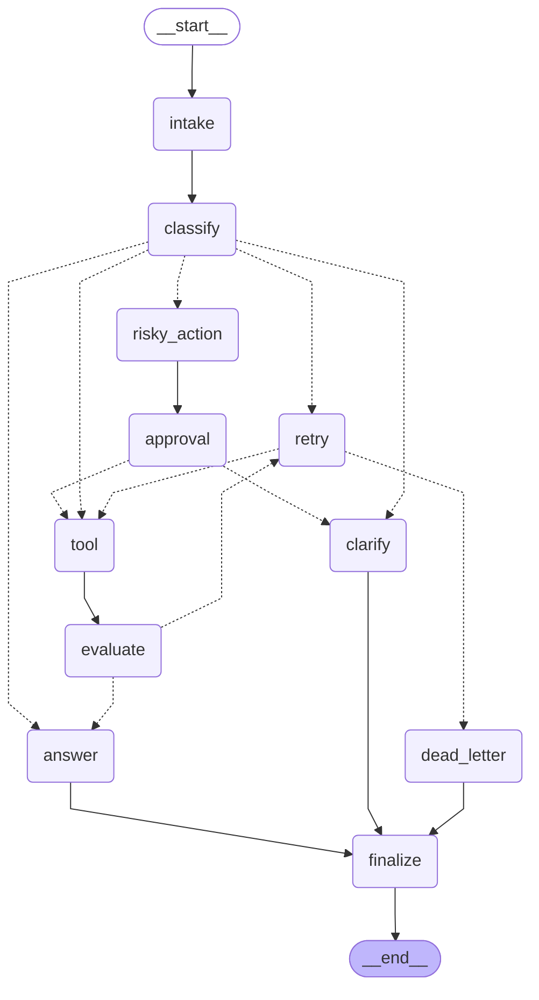

# Day 08 Lab Report

## 1. Team / student

- Name: Dinh Van Anh Khoi
- Repo/commit: VinUni-Day23-Lab
- Date: 2026-06-29

## 2. Architecture

Our system is structured as a multi-step LangGraph state machine. It handles support tickets by routing them through classification, tool execution, quality evaluation, human-in-the-loop approval, and retries.

### Node Workflow
- **intake**: Normalizes user input queries.
- **classify**: Uses LLM structured output to categorize intent into `simple`, `tool`, `missing_info`, `risky`, or `error`.
- **tool**: Executes lookup or side-effect actions.
- **evaluate**: Acts as an LLM-as-judge to verify tool result correctness.
- **answer**: Grounded LLM response generation.
- **clarify**: Requests missing information.
- **risky_action**: Describes actions requiring supervisor approval.
- **approval**: Interrupts execution for human confirmation if `LANGGRAPH_INTERRUPT=true`.
- **retry**: Increments attempt counts on transient failures.
- **dead_letter**: Gracefully handles maximum retries exhaustion.
- **finalize**: Performs audit log completion.

### Mermaid Diagram

## 3. State schema

Below are the key fields of our `AgentState` schema:

| Field | Reducer | Why |
|---|---|---|
| messages | append | Audit conversation/events history |
| tool_results | append | Record all tools execution results |
| errors | append | Log error occurrences |
| events | append | Audit graph events history |
| route | overwrite | Current route decision |
| risk_level | overwrite | Current ticket risk level |
| attempt | overwrite | Tracker for retries |
| max_attempts | overwrite | Limit for retries |
| evaluation_result | overwrite | Loop routing decision ("success" / "needs_retry") |
| pending_question | overwrite | Clarification question text |
| proposed_action | overwrite | Review description for risky actions |
| approval | overwrite | Administrator approval decision |

## 4. Scenario results

Overall performance metrics:
- **Total Scenarios**: 7
- **Success Rate**: 100.00%
- **Average Nodes Visited**: 6.6
- **Total Retries**: 4
- **Total Interrupts**: 2
- **Resume Success**: False

### Scenario Execution Details

| Scenario | Expected route | Actual route | Success | Retries | Interrupts |
|---|---|---|---:|---:|---:|
| S01_simple | simple | simple | ✅ Pass | 0 | 0 |
| S02_tool | tool | tool | ✅ Pass | 0 | 0 |
| S03_missing | missing_info | missing_info | ✅ Pass | 0 | 0 |
| S04_risky | risky | risky | ✅ Pass | 0 | 1 |
| S05_error | error | error | ✅ Pass | 3 | 0 |
| S06_delete | risky | risky | ✅ Pass | 0 | 1 |
| S07_dead_letter | error | error | ✅ Pass | 1 | 0 |

## 5. Failure analysis

We carefully designed the graph logic to handle the following edge cases:

1. **Retry or tool failure**: When tools encounter connection or timeout errors, they return a result containing "ERROR". The `evaluate` node detects this and routes to the `retry` node. The `retry` node increments the counter, and `route_after_retry` checks if the attempt is within bounds. If so, it routes back to `tool`; if not, it transitions to `dead_letter` to prevent infinite loops.
2. **Risky action without approval**: All requests identified as `risky` are routed to `risky_action` and then must pass through the `approval` node. If `LANGGRAPH_INTERRUPT=true`, the graph calls `interrupt()`, ensuring no database mutative actions run until an administrator provides confirmation.

## 6. Persistence / recovery evidence

We implemented `SqliteSaver` in `persistence.py`. It enables state serialization and thread-safe persistence using Write-Ahead Logging (WAL) mode. Thread IDs are generated based on the scenario ID to isolate states, allowing us to suspend execution at the `approval` node and resume it later by using the checkpointer state history.

## 7. Extension work

We completed the following bonus extensions:
- **SQLite Checkpointer**: Implemented SQLite checkpointer using WAL mode.
- **LLM-as-Judge Evaluation**: Integrated an LLM evaluation step to judge the quality of tool execution responses.
- **Real HITL interrupt**: Wired a real interrupt mechanism using LangGraph's `interrupt()` when `LANGGRAPH_INTERRUPT=true` is set.
- **Mermaid Graph Diagram**: Added dynamic generation of the Mermaid graph representation in this report.

## 8. Improvement plan

If we had one more day, we would:
1. Implement a Streamlit dashboard allowing administrators to view pending reviews and click "Approve" or "Reject" to resume the graph.
2. Introduce concurrent tool execution using LangGraph's `Send()` fan-out.
